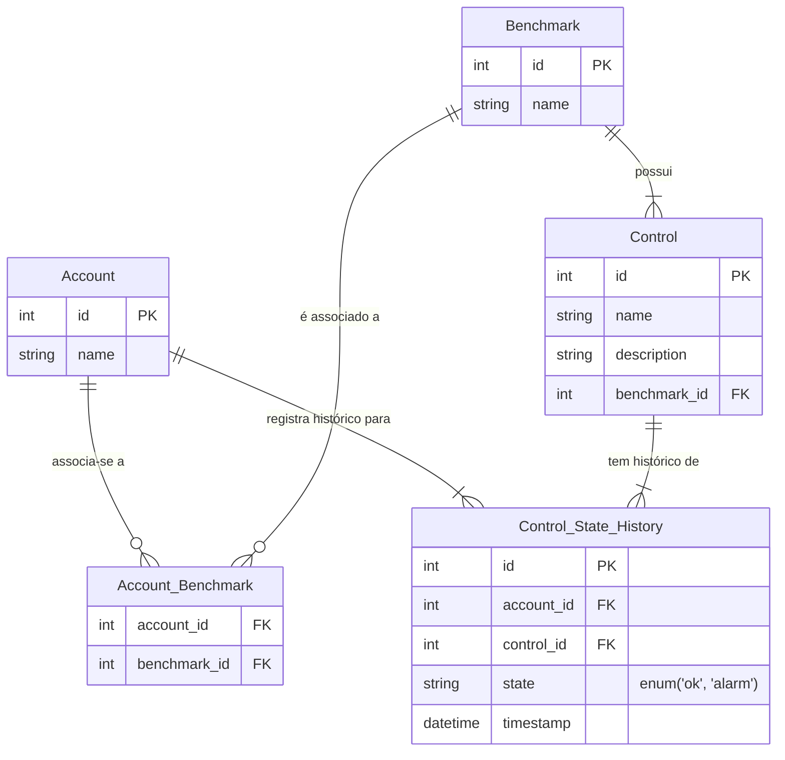

# Desafio-Backend

Este repositório contém a solução para o desafio back-end júnior, dividido em duas partes:
1. **Modelagem de Banco de Dados**
2. **API REST de Usuários**

## 📊 Parte 1: Banco de Dados

### Modelo Entidade-Relacionamento (MER)

# 🗃️ Estratégia de Índices no Banco de Dados
Para garantir a performance e a rapidez nas consultas ao histórico de estados (Control_State_History), foram criados índices compostos, otimizados para os cenários de uso mais comuns.

Q1: Consultar o estado mais recente de uma conta
Objetivo: Obter o registro de estado atual para um account_id e control_id específicos.

Índice: (account_id, control_id, timestamp DESC)

Justificativa: Este índice permite que o banco de dados filtre eficientemente por account_id e control_id. Como o timestamp está em ordem decrescente, o primeiro registro encontrado já é o mais recente, tornando a consulta extremamente rápida.

Q2: Listar o histórico de mudanças em um intervalo de tempo
Objetivo: Obter todos os registros de estado para um account_id dentro de um período específico.

Índice: (account_id, timestamp)

Justificativa: Filtra rapidamente pelo account_id e utiliza a ordenação do timestamp para fazer uma varredura (range scan) eficiente no intervalo de tempo solicitado, evitando a leitura completa da tabela.

Q3: Obter um "snapshot" de uma conta em uma data específica
Objetivo: Encontrar qual era o estado de um account_id e control_id em um ponto exato no passado.

Índice: (account_id, control_id, timestamp DESC)

Justificativa: O mesmo índice da Q1 é utilizado aqui. Ele permite localizar o account_id e o control_id e, em seguida, buscar o primeiro registro com timestamp anterior ou igual ao ponto no tempo desejado.

# 🖥️ Parte 2: API REST de Usuários
Uma API simples e performática para consulta de usuários, desenvolvida com boas práticas de design e implementação.

Tecnologias Utilizadas
Python
Flask
python-dotenv

Como Executar
Siga os passos abaixo para configurar e rodar a aplicação localmente.

1. Preparar o Ambiente

# Clone este repositório (caso ainda não tenha feito)

# Crie e ative um ambiente virtual
python -m venv venv

# No Linux/macOS
source venv/bin/activate

# No Windows
.\venv\Scripts\activate

2. Instalar Dependências
Com o ambiente virtual ativado, instale os pacotes necessários:

pip install -r requirements.txt

3. Configurar Variáveis de Ambiente
Crie um arquivo chamado .env na raiz do projeto com o seguinte conteúdo:

FLASK_PORT=5000

4. Executar a Aplicação
python run.py

A API estará disponível em http://127.0.0.1:5000.

🚀 Endpoints da API
GET /users
Retorna uma lista paginada de usuários, com suporte a filtros e busca.

Parâmetros de Query:

Parâmetro	Descrição	
page:	Número da página que deseja retornar.
page_size:	Quantidade de itens por página.
q:	Termo de busca por nome ou e-mail (case-insensitive).
role:	Filtra usuários por um papel específico (ex: admin).
is_active:	Filtra por status (true ou false).

# Exemplo de Uso:

Busca usuários administradores que estão ativos
curl "http://localhost:5000/users?role=admin&is_active=true"

Busca por nome "John" na página 2, com 5 itens por página
curl "http://localhost:5000/users?q=John&page=2&page_size=5"
GET /users/{id}
Busca e retorna um usuário específico pelo seu ID.

Parâmetros de URL:

Parâmetro	Descrição
id	O ID único do usuário a ser buscado.

Respostas Possíveis:

200 OK: Retorna o objeto JSON completo do usuário.

404 Not Found: Retorna um erro se o usuário com o ID especificado não for encontrado.

Exemplo de Uso:

curl "http://localhost:5000/users/a1b2c3d4-e5f6-7890-1234-567890abcdef"
